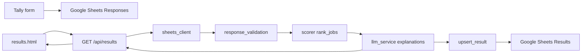

# Career Interest Matching Engine — Project Report

**Date:** 12 May 2026  
**Source of truth:** [MANUAL_CHATGPT_PROMPT_TEMPLATE.md](./MANUAL_CHATGPT_PROMPT_TEMPLATE.md) (v2)  
**Repository:** `ai-interest-career`

---

## 1. Executive summary (client)

The career interest test MVP follows one transparent matching rule: questionnaire answers become a six-dimension profile, jobs are ranked by numeric distance on those dimensions, and an AI model writes short explanations for the top five matches. The AI does not change rank or score.

Respondents complete a Tally form; answers land in Google Sheets; a Python service reads the row, scores it, calls the LLM, and serves a simple results page. Each results request runs a fresh assessment for the selected job catalog. Local development can run without Google Sheets using built-in sample data.

**Why this matters**

- Rankings are reproducible and auditable.
- Explanations stay grounded in questionnaire meaning and job descriptions without hidden weighting.
- The same profiles can be compared across AI providers because ranking is fixed in code.

**Delivery status**

| Area | Status |
|------|--------|
| 48-item questionnaire (A1–F8) and validation | Done |
| Python scoring and tie-breaks | Done |
| Gemini / OpenAI explanation step | Done |
| Google Sheets read/write and mock mode | Done |
| API and results UI (top 5 + summary, catalog switch) | Done |
| Automated tests and scorer benchmark | Done |
| Operator documentation | Partial — README still describes legacy `/api/process` flow |
| Extended 40-job client catalog (`client_40`) | Done in repo and UI |
| Live cross-model explanation benchmark | Optional follow-up |
| Production LLM quota / cost planning | Follow-up |

---

## 2. Product contract

| Decision | Choice |
|----------|--------|
| Assessment shape | 48 items **A1–F8**, integers **0–4** |
| User profile | Six dimension means (0–4, two decimals) |
| Job catalog | Structured JSON with `job_id`, `job_label`, six scores, `short_description` |
| Catalog selection | `core_30` → `data/jobs_30_core.json`; `client_40` → `data/jobs_40_client.json` |
| Ranking | **Python only** — mean absolute distance per dimension, equal weight |
| User-facing output | **Top 5** jobs with `job_label`, `score`, `reason`, plus `summary` |
| LLM role | Explanations and summary only; order and scores fixed before the call |
| User-facing prose | No questionnaire item codes (for example A1, E8) in reasons or summary |
| Default provider | Gemini (`gemini-2.5-flash`) |

**Six dimensions (canonical order)**

1. `creation_expression` (A1–A8)  
2. `analysis_conceptual` (B1–B8)  
3. `technical_manual` (C1–C8)  
4. `physical_bodily` (D1–D8)  
5. `social_collective` (E1–E8)  
6. `organization_management` (F1–F8)

**Scoring formula**

- Per dimension: `distance_d = abs(user_d - job_d)`
- `mean_distance` = average of the six distances  
- `score` = `round((1 - mean_distance / 4) * 100)`

**Tie-break** (when adjacent ranks are within two points): lower maximum single-dimension gap, then lower gap on the user’s top two dimensions, then shorter `short_description`, then stable `job_id` ordering.

---

## 3. System architecture



**Processing sequence**

1. The results page calls **`GET /api/results?email=&job_set=`** (no separate batch process endpoint).
2. Read the latest **Responses** row for that email (`email`, A1–F8; `processed` is optional).
3. Validate all 48 answers.
4. Build `user_dimension_vector`.
5. Load jobs from the requested catalog (`core_30` or `client_40`).
6. Rank jobs and take top **5**.
7. Call Gemini or OpenAI with ranked jobs, item-level answers, and job descriptions.
8. Merge LLM `reason` text onto fixed ranks; sanitize user-facing text; return JSON to the UI.
9. **Write** vector, top jobs, and summary to **Results** for archive/export. The API does **not** read stored Results rows to serve responses.

Changing the job catalog on the results page triggers a new assessment for that catalog.

**Main modules**

| Concern | Location |
|---------|----------|
| Settings and env | `backend/config.py`, `.env` |
| Job catalog | `backend/job_loader.py`, `data/jobs_30_core.json`, `data/jobs_40_client.json` |
| Scoring | `backend/scorer.py` |
| Explanation prompts | `backend/prompt_templates.py` |
| LLM calls | `backend/llm_service.py` |
| Sheets credentials | `backend/google_credentials.py` |
| Sheets I/O | `backend/sheets_client.py` |
| Orchestration | `backend/scoring_engine.py` |
| HTTP API | `backend/main.py` |
| Results UI | `frontend/results.html` |

**API surface**

- `GET /health` — liveness  
- `GET /api/results?email=&job_set=` — run assessment and return JSON (`email`, `user_dimension_vector`, `top_jobs`, `summary`, `job_set`)  
- `GET /results.html?email=&job_set=` — results page (calls the API)

There is **no** `POST /api/process` in the current application.

**Persistence (Results tab)**

- `email`  
- `user_dimension_vector` (JSON)  
- `top_jobs` (JSON array: `job_id`, `job_label`, `score`, `reason`)  
- `summary`

Legacy rows that used `job` instead of `job_label` are still readable when parsing stored Results rows.

---

## 4. Alignment with manual template v2

The manual template describes a full JSON contract for model-in-the-loop testing (`annex`, `notes_for_reviewers`, and LLM-computed ranking). The **production application** implements the same numeric model and explanation policy with a narrower runtime contract:

| Manual template (testing) | Production application |
|---------------------------|-------------------------|
| Model may return full assessment JSON | Python computes ranks; LLM returns `top_jobs` reasons + `summary` only |
| `top_5` with audit fields in `notes_for_reviewers` | `mean_distance` kept in scorer; not exposed on API/UI |
| `annex` and reviewer notes | Not stored in Sheets or API |
| Six benchmark profiles × two job sets | Scorer benchmark on **core_30**; **client_40** selectable in API/UI; full live LLM A/B optional |

Semantic rules are preserved: item-level patterns inform reasons; dimensions are not reweighted in prose; close-score behavior is deterministic in code. Item codes are stripped from user-facing explanation text.

---

## 5. Validation and quality assurance

**Automated tests:** 29 tests (`pytest tests`), covering:

- User vector construction and 0–4 validation  
- Distance formula and tie-break ordering  
- Benchmark profile expectations (six samples vs `jobs_30_core.json`)  
- Mock Sheets pipeline, optional `processed` header, and API (`GET /api/results` with `job_set`)  
- Google service account loading from env fields or default secrets path  
- LLM service with mocked Gemini/OpenAI (same ranks, merged reasons)  
- Sanitization of item codes in user-facing text

**Scorer benchmark:** `scripts/run_benchmark.py` writes `data/benchmark_results/scorer_core_30.json` for all six manual sample profiles on the core 30-job set.

**Manual assets**

| Asset | Purpose |
|-------|---------|
| `data/benchmark_samples.json` | Six benchmark answer profiles |
| `data/test_answers.example.json` | Local answers template |
| `scripts/try_llm.py` | End-to-end or `--scores-only` check |

---

## 6. Operations

**Local run (repository root)**

```powershell
python -m uvicorn main:app --app-dir backend --reload --host 0.0.0.0 --port 8000
```

Use Uvicorn for `/api/*` and the results page. A static file server alone cannot run the full flow.

**Docker**

The image installs `backend/requirements.txt` (including `gspread` and `google-auth`), copies `backend/` and `data/` into `/app`, and starts Uvicorn on port **10000**. Job catalog paths resolve from `/app` when `data/` is present beside the app code.

**Environment**

- `GEMINI_API_KEY` (or `OPENAI_API_KEY`) for explanations  
- `SPREADSHEET_ID`, `RESPONSES_SHEET_NAME`, `RESULTS_SHEET_NAME` for live Sheets  
- Google service account via `GOOGLE_SERVICE_ACCOUNT_*` fields in `.env`, optional `GOOGLE_SERVICE_ACCOUNT_FILE`, or default `secrets/service-account.json` when that file exists  
- `USE_MOCK_SHEETS=true` for local demo without Google (sample email: `demo@example.com`)  
- `JOB_SET` or `job_set` query parameter: `core_30` (default) or `client_40`

Paths in `.env` resolve from the repository root (or `/app` in Docker).

**Responses tab**

Row 1 must include **`email`** and **`A1` … `F8`**. **`processed`** is optional for imports that omit it.

**Deployment**

The hosted frontend may call a separate backend origin (for example Render). CORS on the API must allow the frontend origin. The results page uses the production backend URL when served from the production frontend host; local development should call the same origin as the page.

**Tally redirect (example)**

`https://your-domain.com/results.html?email={field:email}`

---

## 7. Known gaps and recommended next steps

1. Reconcile README and migration docs with the current API (no `/api/process`, no Results read cache).  
2. Run live explanation benchmarks (JSON validity, clarity, tone) across chosen models; ranking will not change between providers.  
3. Plan LLM usage (quota, billing, or caching policy) for production traffic.  
4. Optional: expose reviewer-oriented audit fields if internal QA needs parity with the manual JSON schema.

---

## 8. Documentation map

| Document | Audience |
|----------|----------|
| [README.md](../README.md) | Setup, env vars, Sheets layout, API (partially stale) |
| [MIGRATION_TODO.md](./MIGRATION_TODO.md) | Implementation checklist (sections 1–8 complete) |
| [MANUAL_CHATGPT_PROMPT_TEMPLATE.md](./MANUAL_CHATGPT_PROMPT_TEMPLATE.md) | Prompt and scoring specification |
| [SYSTEM_PROMPT_REPORT.txt](./SYSTEM_PROMPT_REPORT.txt) | Short alignment summary (technical + client) |
| [career_interest_mvp.md](../career_interest_mvp.md) | Legacy MVP note with pointers to current docs |

---

## 9. Client summary (non-technical)

We standardized how career recommendations are produced so results are easier to trust and review. Job order comes from one transparent formula based on how close a person’s interest profile is to each role on six dimensions. The AI still uses the questionnaire and job descriptions, but only to explain the results—not to change rank behind the scenes.

Respondents can compare two job catalogs from the results page; each choice runs a fresh match for that list. Close scores follow a clear tie-break sequence. The product shows the top five roles with short reasons and an overall summary. Quality is checked with six benchmark profiles and automated tests; remaining work is mainly documentation alignment, production LLM capacity, and optional multi-model explanation review.
