# Career Interest Matching Engine — Project Report

**Date:** 11 May 2026  
**Source of truth:** [MANUAL_CHATGPT_PROMPT_TEMPLATE.md](./MANUAL_CHATGPT_PROMPT_TEMPLATE.md) (v2)  
**Repository:** `ai-interest-career`

---

## 1. Executive summary (client)

The career interest test MVP now follows a single, transparent matching rule: questionnaire answers are turned into a six-dimension profile, jobs are ranked by numeric distance on those dimensions, and an AI model writes short explanations for the top five matches. The AI does not change rank or score.

Respondents complete a Tally form; answers land in Google Sheets; a Python service processes each row, stores results, and serves a simple results page. Local development can run without Google Sheets using built-in sample data.

**Why this matters**

- Rankings are reproducible and auditable.
- Explanations stay grounded in questionnaire meaning and job descriptions without hidden weighting.
- The same profiles can be compared across AI providers because ranking is fixed in code.

**Delivery status**

| Area | Status |
|------|--------|
| 48-item questionnaire (A1–F8) and validation | Done |
| Python scoring and tie-breaks | Done |
| Gemini / OpenAI explanation step | Done |
| Google Sheets read/write and mock mode | Done |
| API and results UI (top 5 + summary) | Done |
| Automated tests and scorer benchmark | Done |
| Operator documentation | Done |
| Extended 40-job client catalog (`client_40`) | Blocked — placeholder file in repo |
| Live cross-model explanation benchmark | Optional follow-up |

---

## 2. Product contract

| Decision | Choice |
|----------|--------|
| Assessment shape | 48 items **A1–F8**, integers **0–4** |
| User profile | Six dimension means (0–4, two decimals) |
| Job catalog | Structured JSON with `job_id`, `job_label`, six scores, `short_description` |
| Ranking | **Python only** — mean absolute distance per dimension, equal weight |
| User-facing output | **Top 5** jobs with `job_label`, `score`, `reason`, plus `summary` |
| LLM role | Explanations and summary only; order and scores fixed before the call |
| Default provider | Gemini (`gemini-2.5-flash`) |

**Six dimensions (canonical order)**

1. `creation_expression` (A1–A8)  
2. `analysis_conceptual` (B1–B8)  
3. `technical_manual` (C1–C8)  
4. `physical_bodily` (D1–D8)  
5. `social_collective` (E1–E8)  
6. `organization_management` (F1–F8)

**Scoring formula**

- Per dimension: `distance_d = abs(user_d - job_d)`
- `mean_distance` = average of the six distances  
- `score` = `round((1 - mean_distance / 4) * 100)`

**Tie-break** (when adjacent ranks are within two points): lower maximum single-dimension gap, then lower gap on the user’s top two dimensions, then shorter `short_description`, then stable `job_id` ordering.

---

## 3. System architecture

```mermaid
flowchart LR
  Tally[Tally form] --> Responses[Google Sheets Responses]
  Responses --> Read[sheets_client]
  Read --> Validate[response_validation]
  Validate --> Score[scorer rank_jobs]
  Score --> LLM[llm_service explanations]
  LLM --> Results[Google Sheets Results]
  Results --> API[GET /api/results]
  API --> UI[results.html]
```



**Processing sequence**

1. Read unprocessed rows from **Responses** (`email`, A1–F8, `processed`).
2. Validate all 48 answers.
3. Build `user_dimension_vector`.
4. Load jobs from `data/jobs_30_core.json` (or configured catalog).
5. Rank jobs and take top **5**.
6. Call Gemini or OpenAI with ranked jobs, item-level answers, and job descriptions.
7. Merge LLM `reason` text onto fixed ranks; persist vector, top jobs, and summary to **Results**; mark row processed.

**Main modules**

| Concern | Location |
|---------|----------|
| Settings and env | `backend/config.py`, `.env` |
| Job catalog | `backend/job_loader.py`, `data/jobs_30_core.json` |
| Scoring | `backend/scorer.py` |
| Explanation prompts | `backend/prompt_templates.py` |
| LLM calls | `backend/llm_service.py` |
| Sheets I/O | `backend/sheets_client.py` |
| Orchestration | `backend/scoring_engine.py` |
| HTTP API | `backend/main.py` |
| Results UI | `frontend/results.html` |

**API surface**

- `GET /health` — liveness  
- `GET /api/results?email=` — stored assessment JSON  
- `POST /api/process` — process one email or all pending rows  
- `GET /results.html?email=` — results page (triggers processing when needed)

**Persistence (Results tab)**

- `email`  
- `user_dimension_vector` (JSON)  
- `top_jobs` (JSON array: `job_id`, `job_label`, `score`, `reason`)  
- `summary`

Legacy rows that used `job` instead of `job_label` are still readable.

---

## 4. Alignment with manual template v2

The manual template describes a full JSON contract for model-in-the-loop testing (`annex`, `notes_for_reviewers`, and LLM-computed ranking). The **production application** implements the same numeric model and explanation policy with a narrower runtime contract:

| Manual template (testing) | Production application |
|---------------------------|-------------------------|
| Model may return full assessment JSON | Python computes ranks; LLM returns `top_jobs` reasons + `summary` only |
| `top_5` with audit fields in `notes_for_reviewers` | `mean_distance` kept in scorer; not exposed on API/UI |
| `annex` and reviewer notes | Not stored in Sheets or API |
| Six benchmark profiles × two job sets | Scorer benchmark on **core_30**; `client_40` catalog not yet valid |

Semantic rules are preserved: item-level patterns inform reasons; dimensions are not reweighted in prose; close-score behavior is deterministic in code.

---

## 5. Validation and quality assurance

**Automated tests:** 22 tests passing (`pytest tests`), covering:

- User vector construction and 0–4 validation  
- Distance formula and tie-break ordering  
- Benchmark profile expectations (six samples vs `jobs_30_core.json`)  
- Mock Sheets pipeline and API (`POST /api/process`, `GET /api/results`)  
- LLM service with mocked Gemini/OpenAI (same ranks, merged reasons)

**Scorer benchmark:** `scripts/run_benchmark.py` writes `data/benchmark_results/scorer_core_30.json` for all six manual sample profiles on the core 30-job set. Example (Sample 1 — analytical / technical): top ranks include Research Analyst, Software Tester, UX/UI Designer, Consultant, Data Analyst.

**Manual assets**

| Asset | Purpose |
|-------|---------|
| `data/benchmark_samples.json` | Six benchmark answer profiles |
| `data/sample_responses_row2_sample1.csv` | Sample Responses row for Sheets import |
| `data/test_answers.example.json` | Local answers template |
| `scripts/try_llm.py` | End-to-end or `--scores-only` check |

**Not yet completed**

- Valid `data/jobs_40_client.json` job catalog (current file is assessment-shaped sample output, not a job list).  
- Full A/B run: six samples × two job sets with live LLM calls across multiple models.  
- Production sign-off on real Tally → Sheets → deploy path with service account credentials.

---

## 6. Operations

**Local run (repository root)**

```powershell
python -m uvicorn main:app --app-dir backend --reload --host 0.0.0.0 --port 8000
```

Use Uvicorn for `/api/*` and the results page. A static file server alone cannot run the full flow.

**Environment**

- `GEMINI_API_KEY` (or `OPENAI_API_KEY`) for explanations  
- `GOOGLE_SERVICE_ACCOUNT_FILE` and `SPREADSHEET_ID` for live Sheets  
- `USE_MOCK_SHEETS=true` for local demo without Google (sample email: `demo@example.com`)

Service account JSON is expected under `secrets/` (gitignored). Paths in `.env` resolve from the repository root.

**Tally redirect (example)**

`https://your-domain.com/results.html?email={field:email}`

---

## 7. Known gaps and recommended next steps

1. Replace `data/jobs_40_client.json` with a proper extended catalog and enable `JOB_SET=client_40`.  
2. Run live explanation benchmarks (JSON validity, clarity, tone) across chosen models; ranking will not change between providers.  
3. Connect production spreadsheet and service account; turn off mock mode.  
4. Optional: expose reviewer-oriented audit fields if internal QA needs parity with the manual JSON schema.

---

## 8. Documentation map

| Document | Audience |
|----------|----------|
| [README.md](../README.md) | Setup, env vars, Sheets layout, API |
| [MIGRATION_TODO.md](./MIGRATION_TODO.md) | Implementation checklist (sections 1–8 complete) |
| [MANUAL_CHATGPT_PROMPT_TEMPLATE.md](./MANUAL_CHATGPT_PROMPT_TEMPLATE.md) | Prompt and scoring specification |
| [SYSTEM_PROMPT_REPORT.txt](./SYSTEM_PROMPT_REPORT.txt) | Short alignment summary (technical + client) |
| [career_interest_mvp.md](../career_interest_mvp.md) | Legacy MVP note with pointers to current docs |

---

## 9. Client summary (non-technical)

We standardized how career recommendations are produced so results are easier to trust and review. Job order comes from one transparent formula based on how close a person’s interest profile is to each role on six dimensions. The AI still uses the questionnaire and job descriptions, but only to explain the results—not to change rank behind the scenes.

Close scores follow a clear tie-break sequence. The product shows the top five roles with short reasons and an overall summary. Quality is checked with six benchmark profiles and automated tests; remaining work is mainly wiring the live spreadsheet and finishing the extended job list for client-specific roles.
